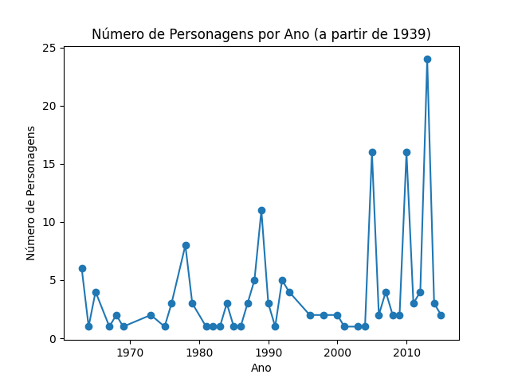
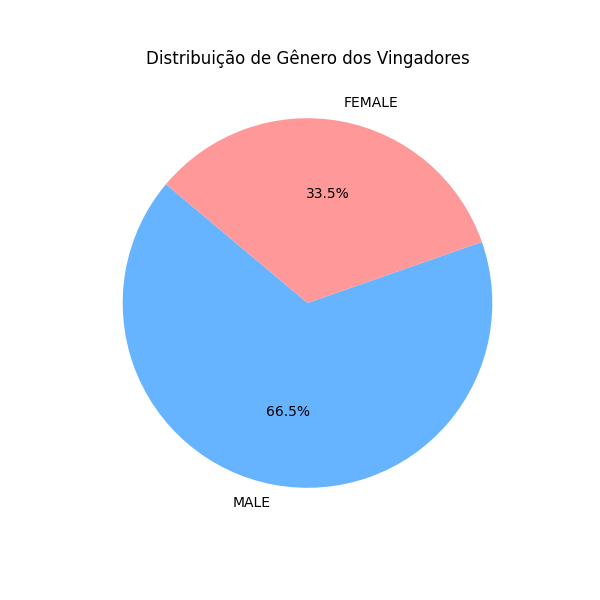
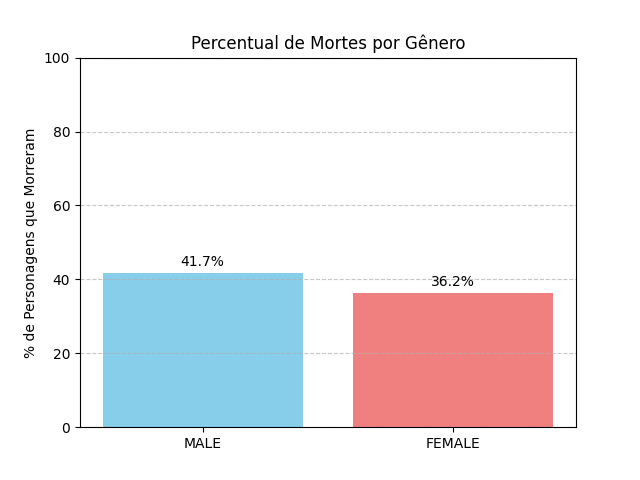

# 🦸‍♀️ Análise dos Vingadores com Python

Este projeto realiza uma análise exploratória de dados dos personagens dos Vingadores utilizando Python e bibliotecas de visualização como pandas, matplotlib e seaborn. Foram investigadas variáveis como gênero, número de aparições, mortes, retornos e evolução temporal, com foco em identificar padrões relevantes na base de dados.

---

## 📊 Tecnologias e Ferramentas

- Python 3.x
- pandas
- matplotlib
- seaborn
- Git e GitHub
- VSCode

---

## 📁 Estrutura de Pastas

analise-vingadores/
├── data/ # Dataset CSV original
├── images/ # Gráficos gerados pela análise
├── src/ # Script principal do projeto
├── .gitignore
├── requirements.txt
└── README.md


---

## 📄 Sobre os Dados

A base de dados utilizada é um arquivo CSV com informações sobre os personagens, incluindo:

- `Gender`: gênero
- `Year`: ano de entrada
- `Appearances`: número de aparições
- `Death1`, `Return1`, etc.: colunas que indicam mortes e retornos
- `Honorary`: tipo de afiliação

---

## 🔎 Análises Realizadas

1. Distribuição de gênero
2. Distribuição de aparições
3. Comparação de aparições por gênero
4. Evolução de personagens por ano e por década
5. Afiliação por gênero (frequência e percentual)
6. Análise de mortes e retornos por gênero
7. Relação entre número de aparições e mortes
8. Heatmap: média de aparições por gênero e ocorrência de morte

---

## 📸 Exemplos de Gráficos

### 📈 Evolução dos Personagens (a partir de 1939)


### 🧍‍♂️🧍‍♀️ Distribuição de Gênero


### ☠️ Percentual de Mortes por Gênero


---

## ▶️ Como Executar o Projeto

1. Clone o repositório:
   ```bash
   git clone https://github.com/Sotrueclara/analise-vingadores.git
